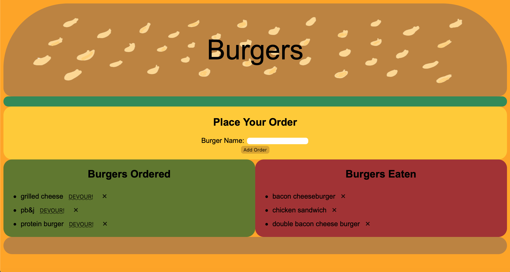

# eating_burgers

## Description
A burger logger with MySQL, Node, Express, Handlebars and a homemade ORM. Following the MVC design pattern; using Node and MySQL to query and route data in the app, and Handlebars to generate the HTML. A restaurant app that lets users input the names of burgers they'd like to eat. Whenever a user submits a burger's name, the app will display the burger on the left side of the page -- waiting to be devoured. App will store every burger in a database, whether devoured or not.

## Table of Contents
* [Title](#Title)
* [Description](#Description)
* [Usage](#Usage)

## Usage
This app is deployed with heroku and contains a MySQL database.

